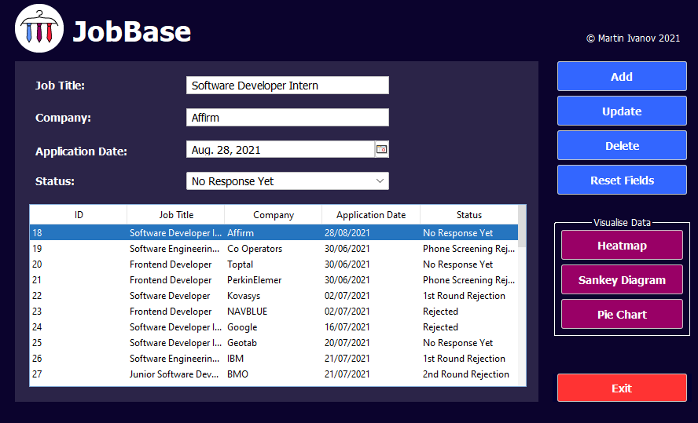
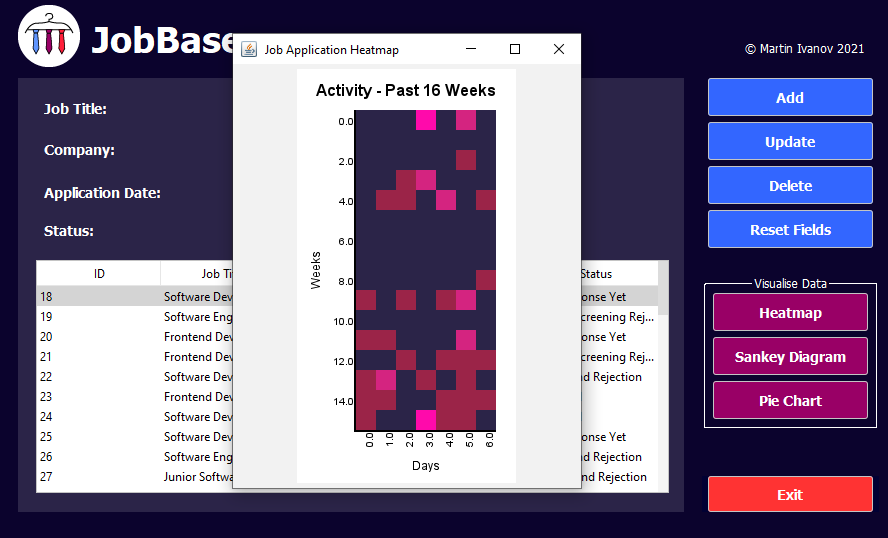
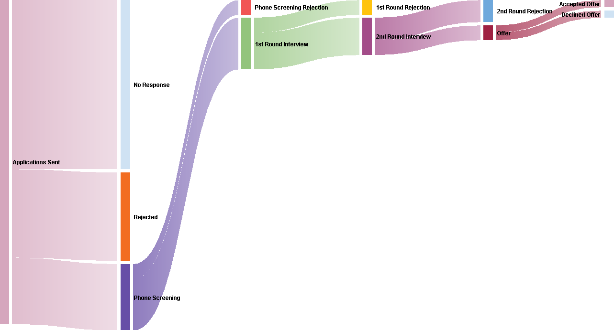
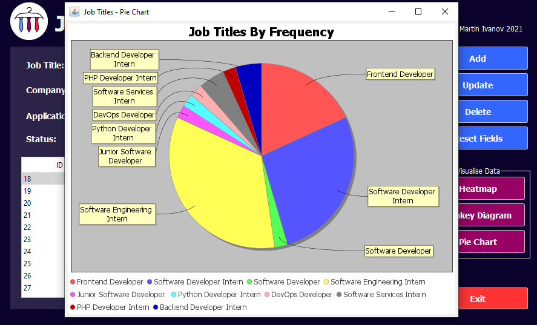
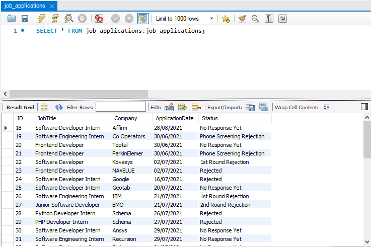

<!--
*** Thanks for checking out the Best-README-Template. If you have a suggestion
*** that would make this better, please fork the repo and create a pull request
*** or simply open an issue with the tag "enhancement".
*** Thanks again! Now go create something AMAZING! :D
***
***
***
*** To avoid retyping too much info. Do a search and replace for the following:
*** martinivnv, job-application-organiser, twitter_handle, martinivnv2002@gmail.com, JobBase, project_description
-->


<!-- PROJECT SHIELDS -->
<!--
*** I'm using markdown "reference style" links for readability.
*** Reference links are enclosed in brackets [ ] instead of parentheses ( ).
*** See the bottom of this document for the declaration of the reference variables
*** for contributors-url, forks-url, etc. This is an optional, concise syntax you may use.
*** https://www.markdownguide.org/basic-syntax/#reference-style-links
-->

<!-- PROJECT LOGO -->
<br />
<p align="center">
  <a href="https://github.com/martinivnv/job-application-organiser">
    
  </a>

  <h3 align="center">JobBase - Job Application Tracker and Visualiser</h3>

  <p align="center">
    A desktop app for tracking and visualising your job applications.  
    <br />
    <a href="https://github.com/martinivnv/job-application-organiser"><strong>Explore the docs »</strong></a>
    <br />
    <br />
    <a href="https://github.com/martinivnv/job-application-organiser/issues">Report Bug</a>
    ·
    <a href="https://github.com/martinivnv/job-application-organiser/issues">Request Feature</a>
  </p>
</p>


<!-- TABLE OF CONTENTS -->
<details open="open">
  <summary><h2 style="display: inline-block">Table of Contents</h2></summary>
  <ol>
    <li>
      <a href="#screenshots">Screenshots</a>
    </li>
    <li>
      <a href="#about-the-project">About The Project</a>
    </li>
    <li>
      <a href="#getting-started">Getting Started</a>
      <ul>
        <li><a href="#dependencies">Dependencies</a></li>
        <li><a href="#installation">Installation</a></li>
      </ul>
    </li>
    <li><a href="#roadmap">Roadmap</a></li>
    <li><a href="#contributing">Contributing</a></li>
    <li><a href="#license">License</a></li>
    <li><a href="#contact">Contact</a></li>
  </ol>
</details>

## Screenshots (*Data used is not real*)
<p align="center">
    
    <p align="center">
      Figure 1: Main screen
    </p>
    <br>
    <p align="center">
      
      <p align="center">
        Figure 2: Heatmap
      </p>
    </p>
    <p align="center">
      
      <p align="center">
        Figure 3: Sankey Diagram
      </p>
    </p>
    <p align="center">
      
      <p align="center">
        Figure 4: Pie Chart
      </p>
    </p>
    <p align="center">
      
      <p align="center">
        Figure 5: MySQL database
      </p>
    </p>
</p>

<!-- ABOUT THE PROJECT -->
## About The Project
With my first ever Co-op application season coming up, I decided to build a desktop app for tracking and visualising all of my job applications. 
The GUI is built with Java Swing in NetBeans and the data entered by the user is stored in a locally hosted MySQL database. 
I decided to include the ability to generate graphs based on the data, including a heatmap of application activity within the past few months, a Sankey diagram of success rates in the various stages of an application, 
and a pie chart of the user's most commonly applied-to job titles.

<!-- GETTING STARTED -->
## Getting Started

To get a local copy up and running follow these simple steps.

### Dependencies
The following necessary libraries are included in the lib directory:
- flatlaf-1.6
- jcalendar-1.4
- jdatepicker-1.3.4
- jfreechart-1.5.3
- jheatchart-0.6
- mysql-connector-java-8.0.26

### Installation

Clone the repo
   ```sh
   git clone https://github.com/martinivnv/job-application-organiser.git
   ```
Setup a local MySQL database and fill in the name and password to it in the MySQL connector in the code.

<!-- ROADMAP -->
## Roadmap

See the [open issues](https://github.com/martinivnv/job-application-organiser/issues) for a list of proposed features (and known issues).


<!-- CONTRIBUTING -->
## Contributing

Contributions are what make the open source community such an amazing place to be learn, inspire, and create. Any contributions you make are **greatly appreciated**.

1. Fork the Project
2. Create your Feature Branch (`git checkout -b feature/AmazingFeature`)
3. Commit your Changes (`git commit -m 'Add some AmazingFeature'`)
4. Push to the Branch (`git push origin feature/AmazingFeature`)
5. Open a Pull Request


<!-- LICENSE -->
## License

Distributed under the MIT License.


<!-- CONTACT -->
## Contact

Martin Ivanov - martinivnv2002@gmail.com

Project Link: [https://github.com/martinivnv/job-application-organiser](https://github.com/martinivnv/job-application-organiser)


<!-- MARKDOWN LINKS & IMAGES -->
<!-- https://www.markdownguide.org/basic-syntax/#reference-style-links -->
[contributors-shield]: https://img.shields.io/github/contributors/martinivnv/repo.svg?style=for-the-badge
[contributors-url]: https://github.com/martinivnv/repo/graphs/contributors
[forks-shield]: https://img.shields.io/github/forks/martinivnv/repo.svg?style=for-the-badge
[forks-url]: https://github.com/martinivnv/repo/network/members
[stars-shield]: https://img.shields.io/github/stars/martinivnv/repo.svg?style=for-the-badge
[stars-url]: https://github.com/martinivnv/repo/stargazers
[issues-shield]: https://img.shields.io/github/issues/martinivnv/repo.svg?style=for-the-badge
[issues-url]: https://github.com/martinivnv/repo/issues
[license-shield]: https://img.shields.io/github/license/martinivnv/repo.svg?style=for-the-badge
[license-url]: https://github.com/martinivnv/repo/blob/master/LICENSE.txt
[linkedin-shield]: https://img.shields.io/badge/-LinkedIn-black.svg?style=for-the-badge&logo=linkedin&colorB=555
[linkedin-url]: https://linkedin.com/in/martinivnv
